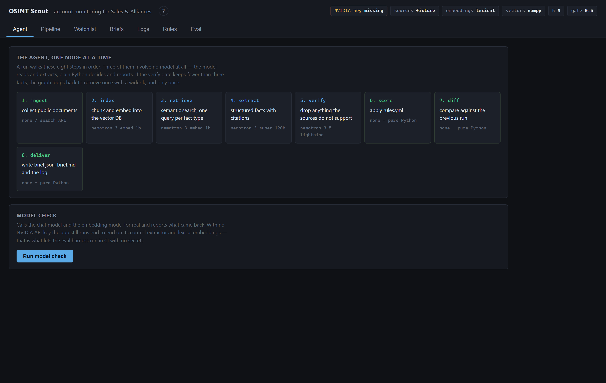
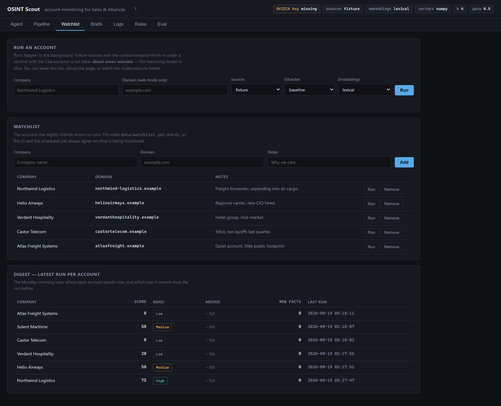
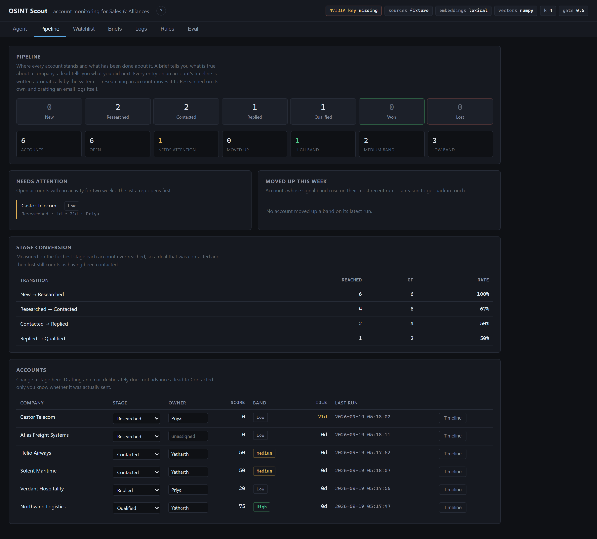
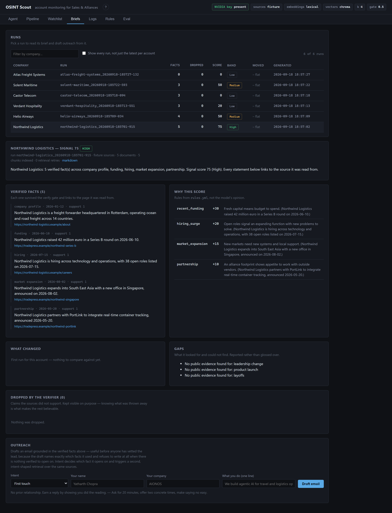
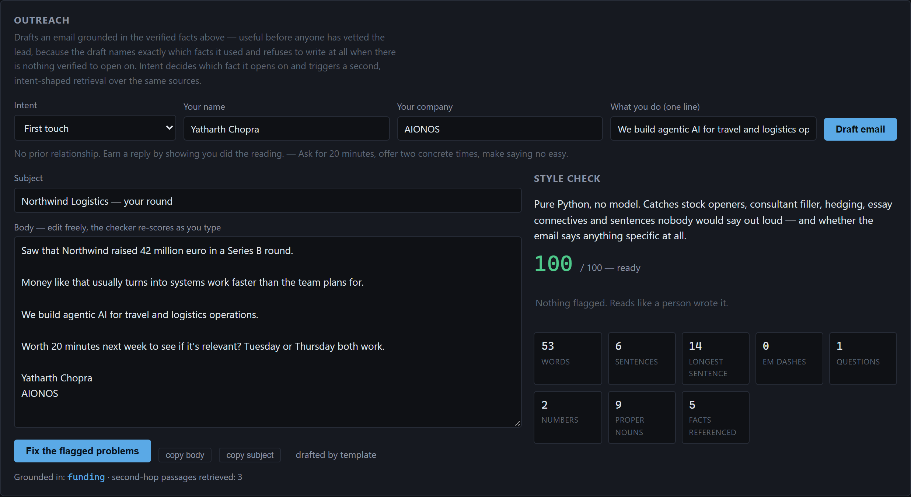
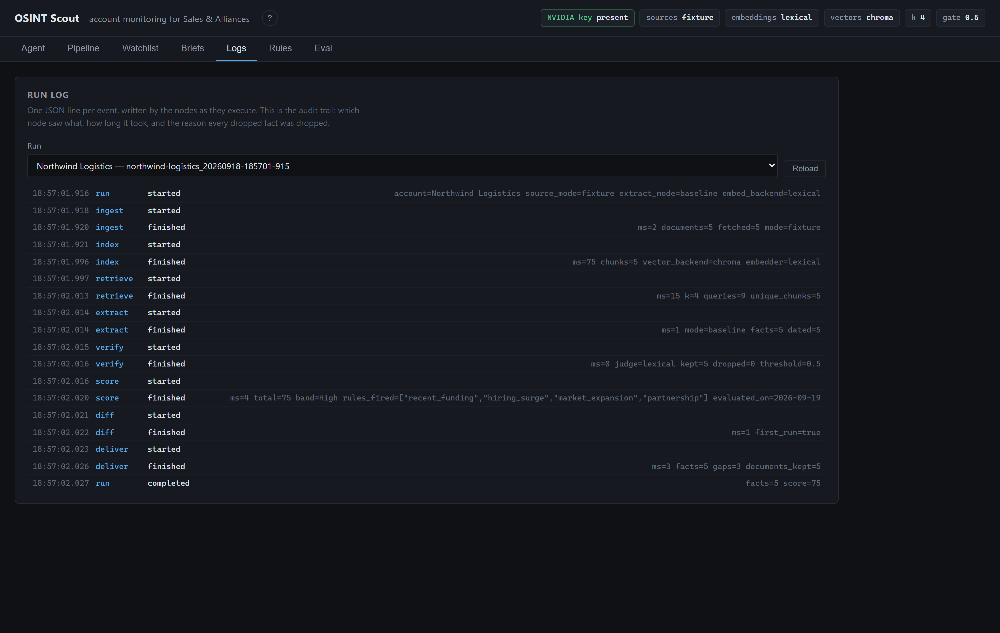
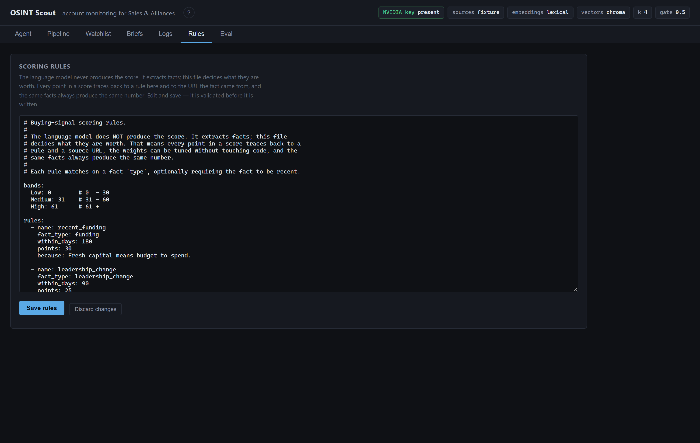
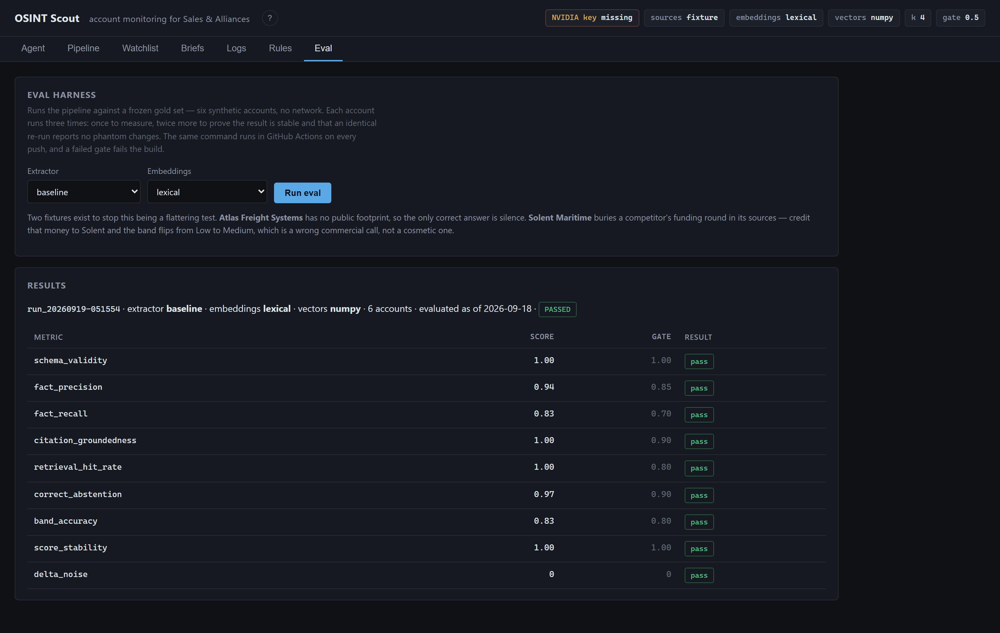
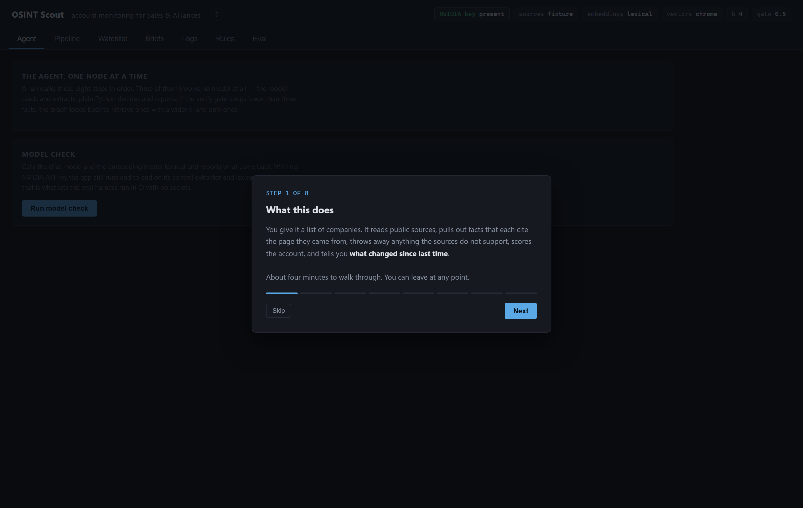

# OSINT Scout

**An agentic account-monitoring tool for Sales & Alliances.**

Give it a list of companies. For each one it:

- Gathers public information and indexes it in a vector database
- Extracts facts, each citing the page it came from
- Discards anything the sources do not support, and shows you what it discarded
- Scores the account with tunable rules rather than a model's opinion
- Drafts the outreach email, grounded only in verified facts
- Reports **what changed since the last run**

Built on open **NVIDIA Nemotron** models, **LangGraph**, and RAG over a vector
database, with an eval harness that runs in CI and fails the build when quality drops.

---

## Demo video

<!-- Paste the demo video link or embed below. -->

> **Watch the walkthrough:** 

https://github.com/user-attachments/assets/2165fe36-bd77-448c-be71-d61695280f57


---

## Contents

- [What problem it solves](#what-problem-it-solves)
- [Quickstart — get it running in 4 commands](#quickstart--get-it-running-in-4-commands)
- [Step-by-step: every screen, and what it is for](#step-by-step-every-screen-and-what-it-is-for)
  - [1. Agent — how the pipeline works](#1-agent--how-the-pipeline-works)
  - [2. Watchlist — run an account](#2-watchlist--run-an-account)
  - [3. Pipeline — where every account stands](#3-pipeline--where-every-account-stands)
  - [4. Briefs — read the research](#4-briefs--read-the-research)
  - [5. Outreach — turn a brief into an email](#5-outreach--turn-a-brief-into-an-email)
  - [6. Logs — the audit trail](#6-logs--the-audit-trail)
  - [7. Rules — you own the score](#7-rules--you-own-the-score)
  - [8. Eval — proof that it works](#8-eval--proof-that-it-works)
  - [9. Tutorial — first run](#9-tutorial--first-run)
- [Architecture](#architecture)
- [The eval harness](#the-eval-harness)
- [Automation with GitHub Actions](#automation-with-github-actions)
- [Models](#models)
- [Scope guardrail](#scope-guardrail)
- [Honest limits](#honest-limits)
- [Repo map](#repo-map)
- [Environment file](#environment-file)

---

## What problem it solves

**The task.** Before a call, a renewal, or a partner conversation, someone spends two
to four hours researching an account:

- Recent news, funding, leadership changes, hiring signals, tech stack
- Repetitive, and inconsistent between reps
- Stale within a month
- No record of where any claim came from

**The cost.**

- Reps spend only **30–40% of their time selling**
- Roughly **11%** goes to CRM data entry, **9–11%** to prospecting research
- Data entry is consistently named the one part of the job that is *fully* automatable

**The catch.** Account research automation is the most commercially validated GenAI
use case in go-to-market — Clay, Clearbit, ZoomInfo Copilot, Common Room and 6sense all
sell a version of it. **So the generic version is a commodity.** Anyone can get a
company summary out of a chatbot with browsing.

Five things make this one different:

| | |
|---|---|
| **Verified extraction** | Every fact carries a source URL and is re-checked against the retrieved text. Unsupported claims are dropped — and the dropped ones stay visible. |
| **Deterministic scoring** | The model extracts. `rules.yml` decides. Same facts in, same number out, and every point traces to a rule and a URL. |
| **Change detection** | A one-off brief is a commodity. A watchlist that tells you what moved this week is a workflow. |
| **Evals in CI** | The agent is regression-tested like software, against a frozen gold set, on every push. |
| **It refuses** | No verified facts, no email. The drafter declines rather than writing something generic. |

---

## Quickstart — get it running in 4 commands

**Requirements:** Python 3.10+ and nothing else. No Docker, no database server, no API
key to get started.

```bash
git clone https://github.com/yatharthchopra2424/OSINT-Scout-Ainos.git
cd OSINT-Scout-Ainos
python -m venv .venv
```

Activate the virtual environment:

```bash
.venv\Scripts\activate
```

<sub>On macOS/Linux use `source .venv/bin/activate` instead.</sub>

Install and configure:

```bash
pip install -r requirements.txt
```

```bash
copy .env.example .env
```

<sub>On macOS/Linux use `cp .env.example .env` instead.</sub>

### Step 1 — prove it works before anything else

```bash
python -m eval.run_eval
```

This runs the whole agent against six frozen gold accounts, three times each, and
scores nine metrics. **It needs no API key and touches no network.** If this passes,
the system is working.

### Step 1b — run the unit tests

```bash
python -m pytest tests -q
```

46 tests covering the parts where a silent mistake changes a commercial answer:
the scoring rules, the style and claim checks, the date back-fill, the model-reply
parser and the boilerplate filter. No network, no key, under a second.

### Step 2 — start the console

```bash
python -m uvicorn app.main:app --port 8000 --reload
```

Open **<http://localhost:8000>**. Interactive API docs are at **`/docs`**.

### Step 3 — turn on the real models (optional)

Everything above runs on a deterministic control path with no key. To use Nemotron,
get a free key at **[build.nvidia.com](https://build.nvidia.com)** → *Get API Key*, then
put it in `.env`:

```bash
NVIDIA_API_KEY=nvapi-your-key-here
EMBED_BACKEND=nemotron
```

For live web sources instead of the bundled fixtures, add a free
[Tavily](https://tavily.com) key and set `SOURCE_MODE=web`.

**A run is two model calls, whichever extractor you choose:**

- One call to extract facts from the retrieved text
- One call to judge every extracted fact against its sources, batched together
- Scoring, change detection and the summary are plain Python and cost nothing

Runs execute in the background, so you can leave the tab or reload the page.
Progress is reported node by node and the run reattaches automatically.

---

## Step-by-step: every screen, and what it is for

> All screenshots below are of the real application running against the **synthetic
> gold-set companies** bundled in `eval/fixtures/`. Nothing here describes a real
> business, which is what makes it safe to ship in a public repo. Clone the repo, run
> the two commands above, and you will see these exact numbers.

---

### 1. Agent — how the pipeline works



**What you are looking at.**

- The eight steps a run walks through, in order
- Blue boxes use a language model; **green boxes are plain Python**
- That split is the whole design: the model reads and extracts, the code decides and reports

**Use it to:**

- **Understand the system in one glance** before touching anything. Each box names what
  the step does and which model, if any, it uses.
- **Check your setup actually works.** Press **Run model check** — it calls the chat
  model and the embedding model *for real* and shows you exactly what came back,
  including the error if something is misconfigured. This is the first thing to run
  when a key is not working.

**The detail worth noticing:** there is exactly one loop in the system. If the verify
gate keeps fewer than three facts, the graph goes back to `retrieve` with a wider `k` —
**once, and only once**. An agent that can loop forever is a bug, not a feature.

---

### 2. Watchlist — run an account



**What you are looking at.** Three panels: the run form, the watchlist that the nightly
job re-runs, and the digest of where every account stands.

**Use case A — research one account now.** Type a company name, choose your options,
press **Run**:

| Control | What it changes |
|---|---|
| **Sources** | `fixture` reads the bundled frozen documents (instant, offline). `web` does live Tavily search + page fetch. |
| **Extractor** | `baseline` is keyword matching — deterministic, no API key, instant. `llm` is Nemotron — better banding, two model calls. |
| **Embeddings** | `lexical` is an offline hashing embedder. `nemotron` is the real retrieval model. |

Progress appears below the form as each of the eight nodes completes, with per-node
timings. **You can close the tab** — the run continues server-side and the page
reattaches to it when you come back.

**Use case B — manage what gets monitored.** The watchlist writes straight to
`data/watchlist.yml`, so the UI and the scheduled GitHub Action never disagree about
what is being tracked. Add, remove, or hit **Run** on any row.

**Use case C — the Monday-morning digest.** The bottom table is the latest run per
account: score, band, which way it moved since the previous run, and how many new facts
appeared. This is the thirty-second version of "what happened to my accounts."

---

### 3. Pipeline — where every account stands



**What you are looking at.**

- A brief tells you what is true about a company; a **lead** tells you what you did next
- Without stage and last-touch there is no pipeline, no stale-deal list, no conversion rate
- That is most of what a salesperson actually looks at

**Everything on an account's timeline is written automatically.**

- Researching an account moves it to *Researched* on its own
- Drafting an email logs itself, with the intent and the style score
- Nobody types what the system already knows

**Use case A — the stage board.** Counts across New → Researched → Contacted → Replied
→ Qualified → Won/Lost, plus totals and band distribution at a glance.

**Use case B — "Needs attention."** Open accounts with no activity for two weeks. This
is the list a rep opens first thing. In the screenshot, Castor Telecom has been idle 21
days and is flagged in amber.

**Use case C — "Moved up this week."** Accounts whose signal band rose on their latest
run. A band that moves from Low to Medium is a concrete reason to get back in touch.

**Use case D — stage conversion.** Measured on the **furthest stage each account ever
reached**, so a deal that was contacted and then lost still counts as having been
contacted. Measuring on current stage instead would quietly flatter the funnel.

**Use case E — the accounts table.** Change stage, assign an owner, see days idle, and
open any account's **Timeline** to read every run, draft and stage change in order.

> **One deliberate refusal:** drafting an email does **not** advance a lead to
> *Contacted*. Only a person knows whether it was actually sent. A tool that advances
> the stage on a draft is inflating your pipeline for you.

---

### 4. Briefs — read the research



**What you are looking at.**

- Every run ever produced, collapsed to the latest per account
- Tick the box for full history, or filter by company
- Click any row to read its brief

**Use case A — verify a claim in one click.** Every fact links to the page it was read
from, with its date and support score. You never have to take the tool's word for
anything.

**Use case B — understand the score.** *Why this score* lists every rule that fired and
what it was worth — `recent_funding +30`, `hiring_surge +20` — with the fact that
triggered it. No model opinion anywhere in that number.

**Use case C — see what changed.** *What changed* compares this run against the previous
one for the same account: band movement, facts that are new, facts that have gone.

**Use case D — see what is missing.** *Gaps* reports the signal types it looked for and
could not find. Most tools hide this; here it is reported, and the eval harness scores
whether staying quiet was the right call.

**Use case E — see what was thrown away.** *Dropped by the verifier* shows claims the
sources did not support, with the reason and the support score. **This is the most
important panel on the screen.** Knowing what the system discarded is what makes the
rest believable.

---

### 5. Outreach — turn a brief into an email



**What you are looking at.**

- The drafter sits at the bottom of every brief
- Useful **before anyone has vetted the lead**: the draft names exactly which facts it used
- It refuses to write at all when there is nothing verified to open on

**Use case A — pick why you are writing.** Intent is the input that matters most, and
the thing a generic "write me an email" prompt always gets wrong:

| Intent | When to use it |
|---|---|
| **First touch** | No prior relationship. Earn a reply by showing you did the reading. |
| **Re-engage** | You spoke before and it went cold; a new signal is the reason to return. |
| **Partnership / alliance** | A joint or channel angle rather than a direct sale. |
| **New executive** | Someone just took the seat — their first two quarters are when vendors get re-evaluated. |
| **Event follow-up** | You met, or were both at the same thing. Short memory window. |
| **Careful timing** | Post-layoffs. The wrong email here costs you the account. |

Each intent declares which fact types to open on, which to **avoid**, and triggers a
**second, intent-shaped retrieval** over the same sources — a partnership email and a
first-touch email ask the index different questions about the same company.

**Use case B — the style check.** Pure Python, no model, deterministic. It catches the
habits that make writing read as generated and weak: stock openers, consultant filler,
hedging, essay connectives, em-dash overuse, sentences nobody would say out loud, and —
the heaviest penalty — **whether the email says anything specific at all**.

```
clean draft      84/100  ready
generic          66/100  needs work     ← no filler, but could be sent to anyone
stock AI phrasing 7/100  rewrite it
```

Edit the body and it re-scores as you type. **Fix the flagged problems** rewrites
against the flags.

**Use case C — the claim check.** Any number in the email that traces to no verified
fact is flagged as an **unverified claim**. This exists because it caught a real bug:
an early version let a *competitor's* funding round into an email to the wrong company.

**Two behaviours worth demonstrating:**

- **It refuses.** Ask it to write to *Atlas Freight Systems* — an account with no public
  footprint — and it declines. A generic email would do more harm than sending nothing.
- **It will not open on layoffs.** The post-layoffs intent declares `avoid: [layoffs]`,
  so even when job cuts are the only fact on file it will not lead with them.

---

### 6. Logs — the audit trail



**What you are looking at.** One JSON line per event, written by the nodes as they
execute. Pick any run from the dropdown.

**Use it to:**

- **See exactly what each node did** — which model it used, how many documents it read,
  how many chunks it indexed, how long it took in milliseconds.
- **Find out why a fact was dropped.** Every rejection is logged with its support score
  and reason, in amber.
- **Debug a disappointing result.** If a brief looks thin, the log tells you whether
  retrieval missed the document, the extractor skipped it, or the verifier killed it.
- **Prove what happened months later.** Runs are plain files on disk — `brief.json`,
  `brief.md`, `run.jsonl` and the raw source documents — so a claim can be audited long
  after the page has been closed.

---

### 7. Rules — you own the score



**What you are looking at.** The scoring rules, editable in the browser.

**Why this screen exists.** A model emitting "buying signal: 73/100" is uncalibrated,
unstable between runs, and indefensible when someone asks why it is not 68. So the
model never produces the score. It extracts facts; **this file decides what they are
worth**:

```yaml
- name: recent_funding
  fact_type: funding
  within_days: 180
  points: 30
  because: Fresh capital means budget to spend.

- name: layoffs
  fact_type: layoffs
  within_days: 90
  points: -20
  because: Cost-cutting usually freezes new vendor spend.
```

**Use it to:** tune the weights to your market, change the recency windows, or add a
rule. Edit and press **Save** — the file is validated before it is written, and the next
run uses it. Nothing is retrained and nothing is hidden. Every point in every score
traces back to a rule here and to the URL the fact came from.

---

### 8. Eval — proof that it works



**What you are looking at.** The gold-set results and every quality gate, pass or fail.

**Use it to:** run the harness from the browser and read the table. The same command
runs in GitHub Actions on every push, and **a failed gate fails the build**.

Each account runs three times: once to measure, twice more to prove the score is stable
and that an identical re-run reports no phantom changes.

**Why the gold set is built to be hard.** Two of the six fixtures exist to create real
headroom rather than a flattering number:

- **`atlas-freight-systems`** has no public footprint at all — the source is navigation
  text. The only correct answer is silence. Any fact here is a hallucination.
- **`solent-maritime`** buries a **competitor's** funding round in its sources.
  Mis-attribute it and the band flips from Low to Medium — a wrong commercial call, not
  a cosmetic error.

---

### 9. Tutorial — first run



**What you are looking at.** A seven-step walkthrough that appears the first time you
open the console. It moves you through the **real tabs** rather than drawing a tour over
a screenshot, so by the end you have already seen the tool you are about to use.

Replay it any time from the **?** in the header. Press `Esc` to dismiss.

---

## Architecture

```
  ingest ──► index ──► retrieve ──► extract ──► verify ──► score ──► diff ──► deliver
 (public    (chunk +   (top-k      (facts +    (drop the   (rules,   (vs last  (brief +
  sources)   embed)     semantic)   citations)  unsupported) not LLM)  run)      log)
        ▲                                          │
        └─────────── widen k, retry once ◄─────────┘
```

A LangGraph state machine. Each node is one file in `app/nodes/`, named after what it
does.

| Node | Does | Model |
|---|---|---|
| `ingest` | Collect public documents (frozen fixtures, or live Tavily + page fetch) | none / search API |
| `index` | Chunk, embed, write to the vector DB | `nemotron-3-embed-1b` |
| `retrieve` | Semantic search, **one focused query per fact type** | `nemotron-3-embed-1b` |
| `extract` | Structured facts with citations, constrained to a schema | `nemotron-3-super-120b-a12b` |
| `verify` | Check each fact against retrieved text; drop what fails | `nemotron-3.5-lightning-30b-a3b` |
| `score` | Apply `app/rules/rules.yml` | **none — pure Python** |
| `diff` | Compare the fact set against the previous run | **none — pure Python** |
| `deliver` | Write `brief.json`, `brief.md`, `run.jsonl` | **none — pure Python** |

**Three of the eight nodes involve no model at all.**

### Why retrieval runs nine queries instead of one

A single generic query buries rare signals. `retrieve` runs one focused query per fact
type — funding, layoffs, leadership change and so on — then unions the results. Recall
on the signals that actually move a score is what matters, not elegance.

### Graceful degradation is not a stub

With no API key the app still runs end to end:

- A keyword control extractor in place of the model
- Lexical hashing embeddings in place of `nemotron-3-embed-1b`
- A quote-and-overlap verifier in place of the model judge

That control path is not a placeholder — **it is the baseline the eval harness measures
the model against**. If Nemotron cannot beat keyword matching, it is not earning its cost.

---

## The eval harness

```bash
python -m eval.run_eval                                          # control, no key needed
python -m eval.run_eval --extract-mode llm --embed-backend nemotron   # Nemotron
```

**Runs against frozen documents in `eval/fixtures/`, never the live web.** If CI hit the
internet the tests would be flaky and the eval would measure the internet's mood rather
than the system.

### Does the model earn its cost?

Three runs per account, same gold set, same pinned date:

| metric | control (keywords) | Nemotron | gate |
|---|---|---|---|
| schema_validity | 1.00 | 1.00 | 1.00 |
| fact_precision | **0.94** | 0.80 | 0.85 |
| fact_recall | 0.83 | **0.96** | 0.70 |
| citation_groundedness | 1.00 | 1.00 | 0.90 |
| retrieval_hit_rate | 1.00 | 1.00 | 0.80 |
| correct_abstention | 0.97 | **1.00** | 0.90 |
| band_accuracy | 0.83 | **1.00** | 0.80 |
| score_stability | 1.00 | 1.00 | 1.00 |
| delta_noise | **0** | 2 | 0 |

**What the model buys you.** The control extractor falls for the attribution trap and
lands Solent Maritime in the wrong band. Nemotron does not, and gets every band right.

**What it costs you, measured rather than hidden:**

- **Lower precision, 0.80 against 0.94.** This is not hallucination: groundedness is
  1.00 and every extra fact is verbatim in the sources. The model finds more true facts
  than the closed gold set anticipated, and a closed-set metric scores that as a miss.
- **`delta_noise` still fails on the model path.** Two accounts report a change on an
  identical re-run, because extraction is non-deterministic at the margins. Matching
  reworded facts by content rather than by wording removed most of it; some remains.
- **Only the control path gates CI**, and it passes all nine. The model path is run
  manually and reported here exactly as it comes out.

### What the harness caught

Four real defects, none of which would have been visible without it:

- **A copyright line extracted as a fact** — "Atlas Freight Systems holds a copyright
  from 2026". Fixed with a boilerplate filter on ingestion.
- **A competitor's funding round attributed to the target company**, which flipped an
  account into the wrong band. Fixed with an explicit attribution rule in the prompt.
- **A missing `event_date`**, which silently turned an account with five correct facts
  from High (75) into Low (0). Fixed by back-filling the date deterministically.
- **Phantom change between identical runs**, because the diff matched facts on their
  exact wording. Fixed by matching on content, with figures decisive.

A gold set that quietly penalised the model for finding true facts the fixtures did not
list was also corrected.

### Unit tests

The eval harness tests the system end to end. These test the pieces where a quiet
mistake would not show up as an obvious failure:

| File | Covers |
|---|---|
| `tests/test_rules_engine.py` | Rules fire inside their window and not outside; undated facts cannot fire a time-windowed rule; layoffs cancel a hiring signal; the score floors at zero; a rule fires at most once; band boundaries; determinism |
| `tests/test_style.py` | Grounded email scores well; stock phrasing is punished; a grammatical but generic email still fails; a number with no supporting fact is flagged; meeting times are not mistaken for claims |
| `tests/test_extract_dates.py` | Dates read from the sentence, the quote, then the cited page's publication date; an existing date is never overwritten; genuinely undated facts are left alone |
| `tests/test_model_output.py` | JSON recovered from fences, prose, thinking tags, braces inside strings and replies cut off mid-object; a 401 is not mistaken for an unsupported-feature 400; boilerplate filtering |

```bash
python -m pytest tests -q
```

### Two things the endpoint does that the code has to survive

**`guided_json` is not always accepted.**

- The NIM endpoint rejects it with a 400 on some backend instances and accepts it on
  others — same model, same key, minutes apart
- `clients.structured()` tries the strict path, then falls back to asking for the same
  shape in the prompt
- The reply is read with a balanced-brace parser that copes with code fences, prose
  around the JSON, and replies cut off mid-object
- Both paths validate against the schema, so nothing unshaped gets through

**The model leaves out dates.**

- Asked for `event_date` it frequently returns null
- A fact with no date cannot fire a time-windowed rule, which silently turned one
  account from **High (75) into Low (0)** on a run where every fact was correct
- The date is not a judgement call: it is written in the sentence, or it is the
  publication date of the cited page
- So `extract` back-fills it deterministically rather than asking the model again

**The models think before answering, and that is switched off.** Nemotron 3 reasons by
default. For "read these documents and return this JSON" that is pure cost, and the
reasoning leaks into the answer. Sending `chat_template_kwargs={"thinking": false}`
took one identical prompt from **7.4s to 1.0s** on Super and **28.8s to 5.8s** on
Lightning, and stopped Lightning replying with "Here's a thinking process:" instead of
the JSON. End to end this took a full account run from **446 seconds to 36**.

---

## Automation with GitHub Actions

**`.github/workflows/eval.yml`** — runs the unit tests and then the gold set on every
push and pull request, and **fails the build if a gate drops**. No secrets required; the control extractor and
lexical embeddings run offline.

**`.github/workflows/watchlist.yml`** — nightly cron over `data/watchlist.yml`: refresh
every account, commit the briefs to `reports/`, and **open a GitHub Issue when an account
moves up a band**. Nobody has to remember to run anything.

```bash
python -m scripts.refresh_watchlist        # what the nightly job executes
```

---

## Models

All free endpoints on [build.nvidia.com](https://build.nvidia.com), OpenAI-compatible at
`https://integrate.api.nvidia.com/v1`:

| Role | Model |
|---|---|
| Reasoning, extraction | `nvidia/nemotron-3-super-120b-a12b` — 1M context, tool calling, structured output |
| Verification judge | `nvidia/nemotron-3.5-lightning-30b-a3b` — cheap enough to run per fact |
| Embeddings | `nvidia/nemotron-3-embed-1b` |

Accessed through `langchain-nvidia-ai-endpoints`, which sends `input_type=passage` when
indexing and `input_type=query` when searching. Getting that backwards silently destroys
retrieval accuracy, so the wrapper handles it rather than us.

---

## Scope guardrail

**Company-level public information only.**

- No people dossiers, no scraping personal profiles
- No compiling information about individuals across sources
- Named executives appear only as a role and an appointment, from a public announcement
- `robots.txt` is respected and every fetch is cached

**The gold-set companies are synthetic.** Nothing in `eval/fixtures/` describes a real
business, which is what makes it safe to commit.

**Use public or synthetic data only.** NVIDIA's free tier logs inputs and outputs under
its trial terms. Real customer data needs a self-hosted NIM or a paid endpoint.

---

## Honest limits

This is internal-tools grade: deployable for one team behind a VPN with a human reviewing
output before it reaches a customer. It is **not** a product.

- **The data layer is the moat, and this does not have one.** News sites paywall and
  block, LinkedIn is off-limits, search APIs cost money. ZoomInfo and Clearbit are worth
  billions because they own licensed data, not because of clever prompts.
- **Coverage fails on SMBs and stealth companies** — not enough public surface.
  `atlas-freight-systems` is that case, measured rather than hidden.
- **Throughput is bounded by the free tier**, which allows roughly 40 requests a
  minute and returns a 503 when the shared endpoint is busy. Calls retry with
  backoff; a self-hosted NIM removes the ceiling.
- **Jobs live in the server process**, so restarting it kills an in-flight run. The UI
  reports it rather than hanging, but the work is lost. Production needs a job queue.
- **Not built:** auth, multi-tenancy, per-tenant rate limits, secret rotation, audit
  retention, CRM write-back, contact-level enrichment.

**How much of sales can actually be automated:** research ~80%, CRM logging ~90%,
first-draft outreach ~70% with human approval, qualification and closing ~0%. Net,
roughly a fifth to a quarter of a rep's week — real, and not the "AI replaces SDRs"
claim.

---

## Repo map

```
app/
  main.py              FastAPI — every endpoint exists because a UI tab needs it
  graph.py             the LangGraph wiring, and the one retry edge
  state.py             what flows between nodes
  config.py            every setting, in one place
  nodes/               ingest index retrieve extract verify score diff deliver
  rag/                 chunker · embeddings (nemotron | lexical) · store (chroma | numpy)
  sources/             fixtures (frozen) · web (Tavily, cached) · clean (boilerplate filter)
  schemas/brief.py     the data contract
  prompts/*.md         versioned prompts, one per stage — diffable in a PR
  rules/rules.yml      the scoring rules
  ops/                 run_log · store · watchlist · leads · jobs
  outreach/            intents · drafter (2-hop grounded) · style (the checker)
  web/                 the console — plain HTML/CSS/JS, no build step
eval/
  fixtures/            6 synthetic accounts, frozen documents, gold facts
  metrics.py           scoring, re-checked independently of the pipeline
  run_eval.py          the harness
tests/                 46 unit tests — rules, style, dates, model-reply parsing
scripts/
  refresh_watchlist.py what the nightly Action runs
  capture_screens.py   regenerates the screenshots in this README
docs/screenshots/      the images above
.github/workflows/     eval.yml · watchlist.yml
```

**Cost to run:** $0. NVIDIA NIM free tier, Tavily free tier, Chroma local, GitHub
Actions free.

---

<br>

# ENVIRONMENT FILE

# The `.env` file is not in this repository — API keys must never be committed.

## **Download the `.env` file:** [**drive.google.com**](https://drive.google.com/file/d/1xUXrKkoruOH-YZQUR_3E24T3lyKHTaPY/view?usp=sharing)

<br>

Place the downloaded file in the **root of the project**, next to `README.md`:

```
OSINT-Scout-Ainos/
├── .env          ← here
├── README.md
├── app/
└── eval/
```

**Or create your own** by copying `.env.example` and filling in two free keys:

```bash
copy .env.example .env
```

| Variable | Where to get it | Required? |
|---|---|---|
| `NVIDIA_API_KEY` | [build.nvidia.com](https://build.nvidia.com) → *Get API Key* | No — the app runs without it |
| `TAVILY_API_KEY` | [tavily.com](https://tavily.com) | Only for `SOURCE_MODE=web` |

> **The application runs completely without any API key.** The eval harness, the whole
> pipeline, the console and every screenshot in this README work on the offline control
> path. Keys only switch on the Nemotron models and live web sources.

<br>

---

## License

[MIT](LICENSE) © 2026 Yatharth Chopra
